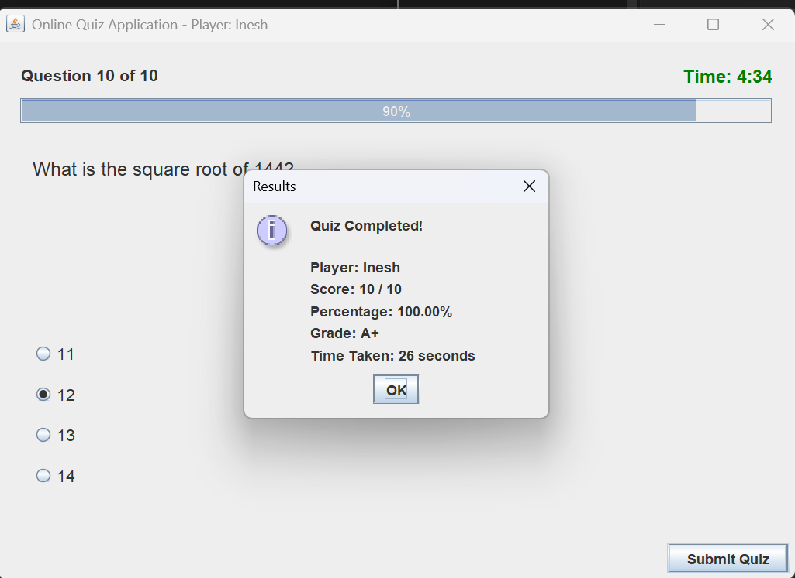
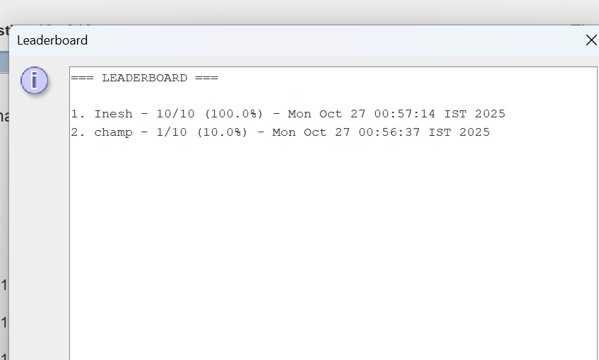

Online Quiz Application

A Java Swing-based quiz application that allows users to take multiple-choice quizzes, track scores, and view a leaderboard. Questions and scores are saved locally in text files.

📝 Features

User-friendly Java Swing GUI

Supports multiple-choice questions with 4 options each

Timer-based quiz with visual countdown and color-coded alerts

Displays score, grade, and time taken after quiz completion

Leaderboard showing top 10 players

Persistent storage of questions (questions.dat) and scores (scores.dat)

Shuffle questions for randomness

Option to retake the quiz after completion

💻 Getting Started
Prerequisites

Java JDK 8 or higher

IDE or editor (VS Code, IntelliJ IDEA, Eclipse)

Basic knowledge of running Java Swing applications

Clone the Repository
git clone https://github.com/IneshAg/Employee-Payroll-System.git
cd Employee-Payroll-System

Compile and Run
Using Terminal:
javac -d bin Quiz/OnlineQuizApplication.java
java -cp bin Quiz.OnlineQuizApplication

Using IDE:

Open the project in your IDE.

Compile and run OnlineQuizApplication.java.

📂 Project Structure
Employee-Payroll-System/
├─ Quiz/
│  ├─ OnlineQuizApplication.java   # Main quiz application
│  └─ questions.dat                # Stores quiz questions
├─ EmployeePayrollSystem.java      # Another project in the repo
├─ scores.dat                      # Stores player scores
└─ README.md

⚙️ How It Works

On launch, the user is prompted to enter their name.

Questions are loaded from questions.dat; if not present, sample questions are created.

Questions are displayed one at a time with 4 options.

Timer counts down from 5 minutes; colors indicate urgency.

User selects an answer and clicks Next.

On the last question, Submit Quiz calculates the score and shows results.

Results include score, percentage, grade, and time taken.

Leaderboard displays top 10 scores sorted descendingly.

Scores are saved in scores.dat for persistence.

🎯 Key Classes

OnlineQuizApplication – Main class handling GUI, quiz logic, and timer

Question – Represents a quiz question with options and correct answer

Score – Represents a player’s score, total questions, and date

📌 Features to Improve (Future)

Add categories and difficulty levels for questions

Integrate database support instead of .dat files

Add images or multimedia questions

Implement user authentication

Image:

🛠️ License

This project is open-source and free to use for educational purposes.